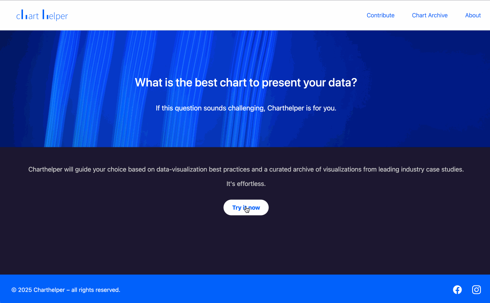

I created Charthelper to support professionals, students, and anyone working with data storytelling in choosing the right visualization for their needs.
In today's digital world, selecting the right chart can make the difference when presenting complex information.
The idea behind Charthelper was to simplify this process through an intuitive, question-driven flow and to build a collaborative archive of real-world examples.
I was inspired by the many resources available, but I wanted something more visual, fast, and accessible for everyday users as I felt the existing ones were overwhelming the user in providing all of the available options from the beginning without first understanding the user's need.

Here are the technologies I used.
Frontend:
Svelte: Lightweight JavaScript framework for building fast, reactive applications.
Svelte SPA Router: This is for client-side routing across pages (homepage, questionnaire, contributor, about, chart archive).

Backend:
Supabase: Backend-as-a-Service platform providing:
Realtime Database (PostgreSQL)
API for fetching and updating chart example entries

Styling:
Custom CSS is written manually, following optimization principles (no CSS libraries like Bootstrap/Tailwind).
Use of BEM-style class structure for clarity and scalability.

Chart Utilities:
Google Charts: To render sample charts dynamically based on user selections.

## Preview

